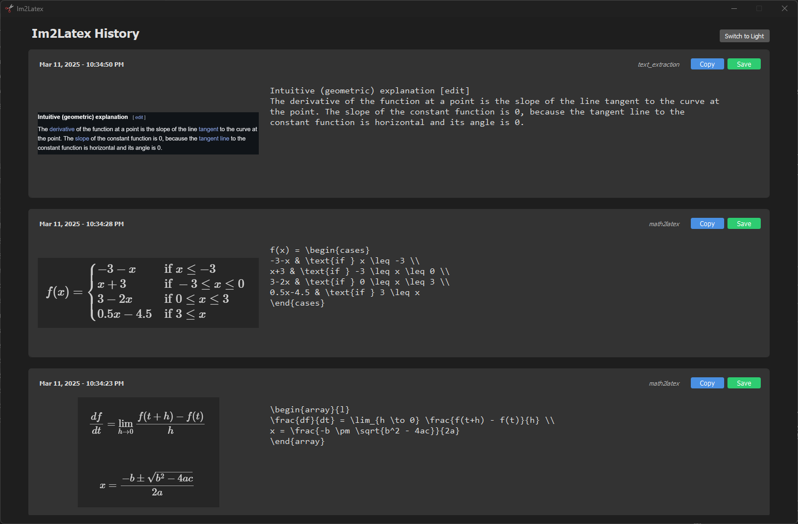

# Im2Latex

  
**Convert mathematical images to LaTeX code with a single shortcut.**

[](LICENSE)
[](https://www.python.org/downloads/)
[]()
[]()
[](https://github.com/username/im2latex/releases)
[](https://github.com/username/im2latex/issues)


Capture a screenshot of mathematical expressions and instantly convert it to LaTeX code, copied to your clipboard, using Google Gemini Flash 2.0. Get an API key with free Flash usage at https://aistudio.google.com/app/apikey. Also does other things with screenshots and the google gen ai API.


## Features

- **Instant Conversion**: Capture any math expression and get LaTeX code on your clipboard.
- **Custom Shortcuts**: Configurable commands and shortctus via `config.json`. Add new commands with associated shortcuts
- **Sound Feedback**: Audio cue when conversion is done and LaTeX is ready to paste.
- **Platform Goals**: Windows-ready now; Linux/macOS support coming soon.

Default commands, each mapped to a shortcut:

1. math2latex: Convert math content (handwritten or already rendered) into pasteable latex code
2. text_extraction: Extract all text from screenshot in plain formatting
3. table: Convert image into latex formatted table
4. chem2smiles: Convert chemical structure/s in image to pasteable SMILES formatting

---

## Setup
1. **Clone Repo**
   Clone or download as zip into an installation directory.

   ```
   git clone https://github.com/jask-aran/im2latex.git
   cd im2latex
   ```

3. **Set Up Virtual Environment & Install Dependencies**
   Run in installation directory
   ```
   python -m venv .venv
   .venv\Scripts\activate  # Windows
   source .venv/bin/activate  # Linux/macOS

   pip install -r requirements.txt
   ```

5. **Configure API Key**  
   - Run `main.py` once to generate a default `config.json`:
    ```
    .venv\Scripts\activate
    python main.py
    ```
   - Edit `config.json` in the project folder to add your Google Generative AI API key

6. **Run the Application**  
   ```
   .venv\Scripts\activate
   python main.py
   ```

### Optional: Install as a Windows App
To make Im2Latex act like an installed application (accessible via Windows Search or Start Menu):
1. Run the provided `install.bat` script from the repository root. This uses .venv\Scripts\pythonw main.py to launch without a console window.
2. Launch Im2Latex from Windows Search or Start Menu as "Im2Latex".

#### What `install.bat` does:
  - Creates a virtual environment (`.venv`) in the current directory if it doesn’t exist.
  - Installs dependencies from `requirements.txt` into the venv.
  - Adds a Start Menu shortcut named "Im2Latex" that runs `main.py` using the venv’s Python instance

**Note:** If you move the repository folder after running `install.bat`, the shortcut will break unless you rerun the script to update it.

## GUI
1. **View History**: See all your previous conversions in reverse chronological order.
2. **Copy LaTeX**: Copy previously generated LaTeX code/ text with a single click.
3. **Save Images**: Save the original screenshots to your preferred location.
4. **View Full-size Images**: Click on any thumbnail to see the full-size image.
5. **Toggle Theme**: Switch between dark and light modes with the theme button.



## Customizing Shortcuts

Modify the default shortcuts by editing `config.json`:
1. Open `config.json` in the project folder.
2. Update the `shortcuts` section, 'action' corresponds to a prompt for the LLM also defined in the config:
   ```json
   {
      "api_key": "[MASKED_API_KEY]",
      "prompts": {
         "math2latex": "prompt1",
         "text_extraction": "prompt2",
         "table": "prompt3",
         "chem2smiles": "prompt4"
      },
      "shortcuts": {
         "windows": [
               {"shortcut_str": "ctrl+alt+z", "action": "math2latex"},
               {"shortcut_str": "ctrl+alt+x", "action": "text_extraction"},
               {"shortcut_str": "ctrl+alt+c", "action": "table"},
               {"shortcut_str": "ctrl+alt+s", "action": "chem2smiles"}
         ],
         "darwin": [
               {"shortcut_str": "ctrl+alt+z", "action": "math2latex"},
               {"shortcut_str": "ctrl+alt+x", "action": "text_extraction"},
               {"shortcut_str": "ctrl+alt+c", "action": "table"},
               {"shortcut_str": "ctrl+alt+s", "action": "chem2smiles"}
         ],
         "linux": [
               {"shortcut_str": "ctrl+alt+z", "action": "math2latex"},
               {"shortcut_str": "ctrl+alt+x", "action": "text_extraction"},
               {"shortcut_str": "ctrl+alt+c", "action": "table"},
               {"shortcut_str": "ctrl+alt+s", "action": "chem2smiles"}
         ]
      }
   }
   ```
3. Supported modifiers:
   - **Windows**: `win`, `ctrl`, `alt`, `shift`
   - **macOS** (`darwin` config key): `cmd`, `ctrl`, `alt`/`option`, `shift`
   - **Linux**: `super`/`win`, `ctrl`, `alt`, `shift`
   Supported keys: `a-z`, `0-9`

