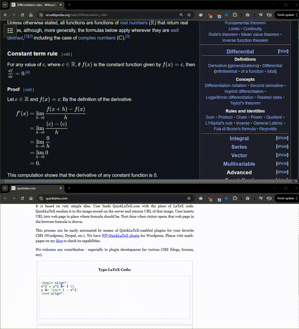

# Im2Latex

A tool to convert mathematical images to LaTeX code using Google Generative AI.




## Setup & Building

### Option 1: Using the Build Script (Recommended for Windows)
1. Simply run the included `build.bat` script, which will:
   - Create a virtual environment
   - Install required dependencies
   - Build the executable for you
2. After building, find the executable in the `dist` folder.

### Option 2: Manual Setup & Build
Only needed if not using the build script:
1. Install Python 3.8+ (https://www.python.org/downloads/).
2. Create a virtual environment:
   - Windows: `python -m venv .venv`
   - Linux/Mac: `python3 -m venv .venv`
3. Activate the virtual environment:
   - Windows: `.venv\Scripts\activate`
   - Linux/Mac: `source .venv/bin/activate`
4. Install dependencies:
   - `pip install -r requirements.txt`
5. Build the executable:
   ```
   pyinstaller --onefile --windowed --add-data "assets;assets" --hidden-import=google.generativeai --icon=assets/scissor.png --name=Im2Latex main.py
   ```

## Configuration
1. Run the executable from the `dist` folder.
2. On first run, the application will create a default `config.json` file.
3. Replace `YOUR_API_KEY_HERE` with your Google Generative AI API key.
4. Restart the application.

## Usage
- Press Win+Shift+Z to capture a screenshot region.
- The application will:
  - Convert the mathematical content in the screenshot to LaTeX code
  - Automatically copy the LaTeX code to your clipboard
  - Play a sound notification when conversion is complete
- Right-click the system tray icon for additional options:
  - Open the application folder
  - Exit the application

## Features
- Easy screen capture with rubber band selection
- Automatic conversion of mathematical expressions to LaTeX
- Clipboard integration for quick pasting
- System tray operation for minimal interference
- Sound notification when processing is complete

## Notes
- The application requires a valid Google Generative AI API key to function.
- The `assets` folder and `config.json` must be in the same directory as the executable.
- When capturing complex mathematical expressions, ensure the entire expression is within the selection.